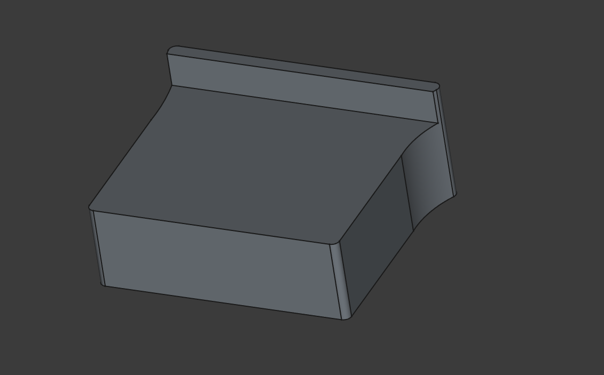
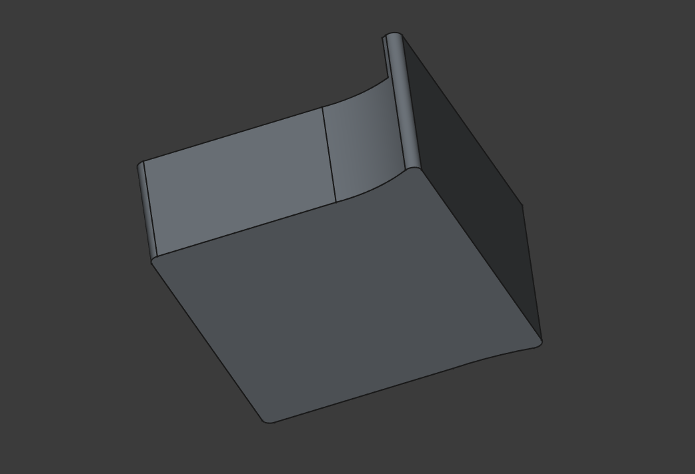

# Бустер для веб-камеры Logitech C270

[&larr; Назад в список моделей](../README.md)

Подложка для крепления веб-камеры на монитор. Клеется снизу на двусторонний скотч. Благодаря этому веб-камеры приподнимается примерно на 12 мм и уже не перекрывает верхнюю часть изображения на мониторе. Проблема появилась из-за того, что эта камера была спроектирована ещё тогда, когда у мониторов были огромные рамки, а у современных мониторов рамки менее сантиметра, и это проблема.

## Файлы модели

* [Logitech C270 Booster.FCStd](Logitech%20C270%20Booster.FCStd)
* [Logitech C270 Booster.stl](Logitech%20C270%20Booster.stl)

## Картинки

