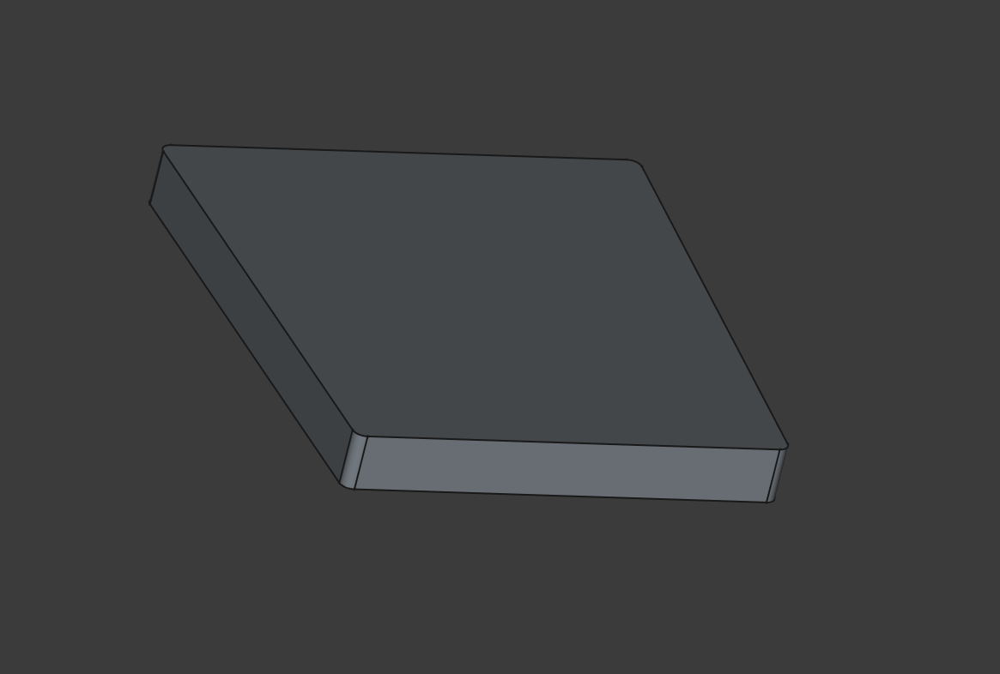
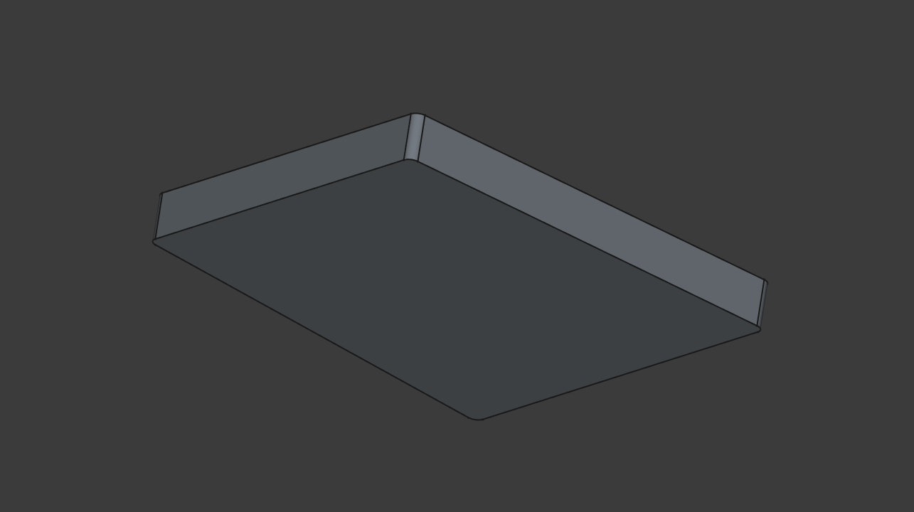

# Бустер для веб-камеры Logitech C922 Pro

Простейшая подложка для крепления веб-камеры. Клеется снизу на двусторонний скотч. Благодаря этому козырёк веб-камеры, которым она цепляется за экран монитора, не налезает на видимую часть экрана. Проблема появилась из-за того, что эта камера была спроектирована ещё тогда, когда у мониторов были огромные рамки, а у современных мониторов рамки менее сантиметра, и это проблема.

## Файлы модели

* [Logitech C922Pro Booster.FCStd](Logitech%20C922Pro%20Booster.FCStd)
* [Logitech C922Pro Booster.stl](Logitech%20C922Pro%20Booster.stl)

## Картинки

