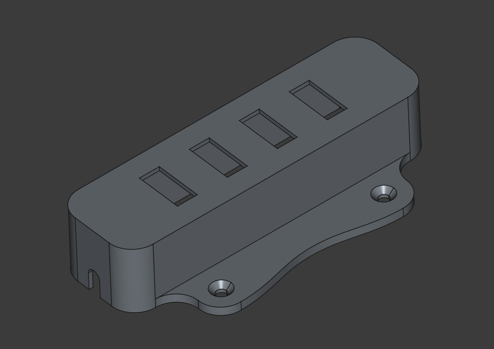
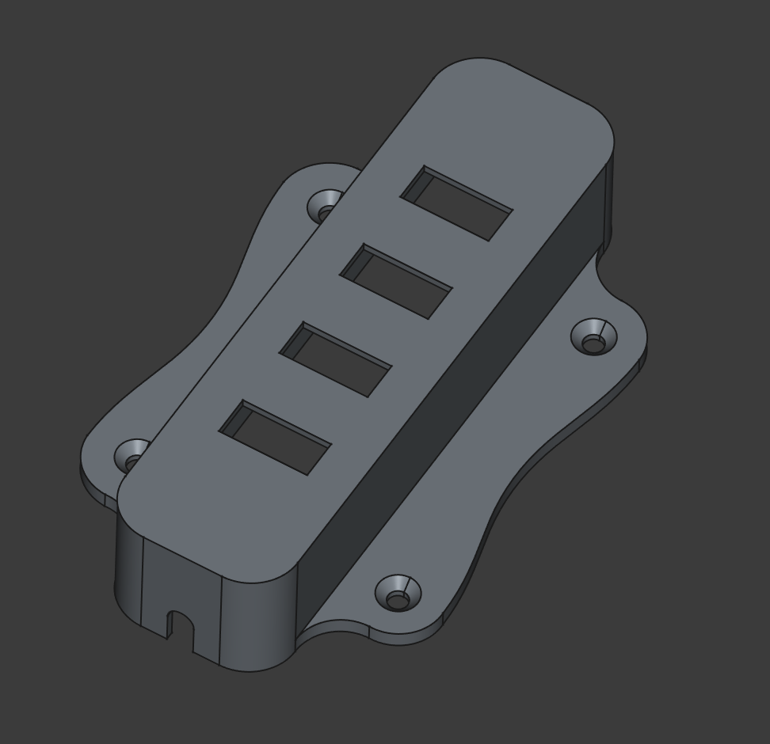
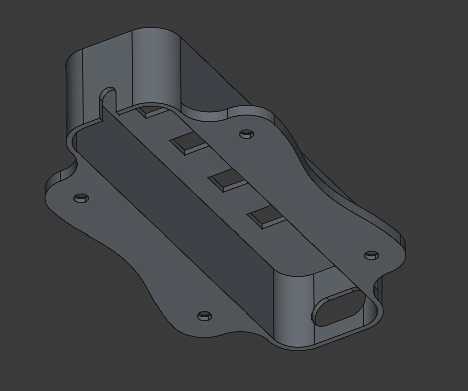
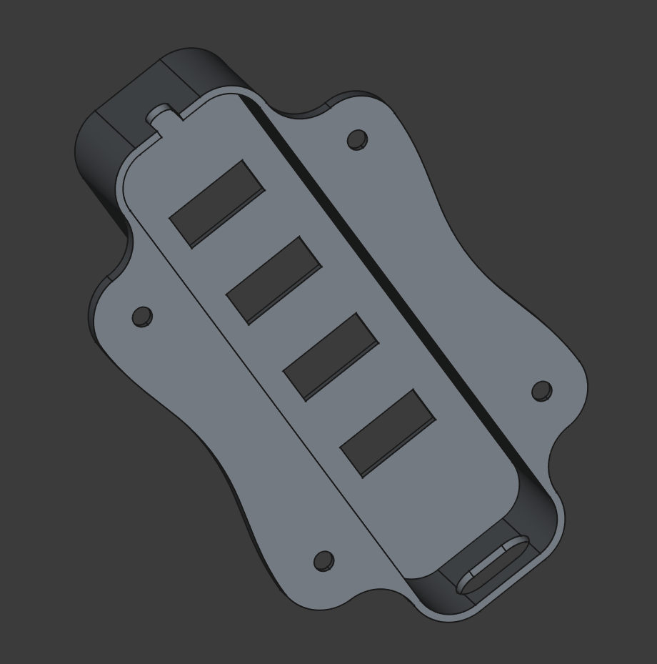
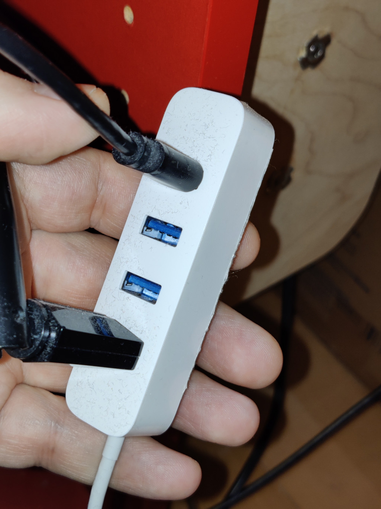

# Крепление для USB Hub Xiaomi XMFXQ01QM

[&larr; Назад в список моделей](../README.md)

Есть у меня вот такой USB хаб Xiaomi, купленный в ноябре 2021 (сейчас он уже снят с продажи и найти его непросто). И понадобилось мне закрепить его на стенке, а у него нет абсолютно никаких возможностей для этого. Пробовал крепить на двусторонний скотч. Он держался какое-то время, но под тяжестью подключенных к нему проводов через какое-то кол-во дней отпадывал. Поэтому я сделал для него такой как бы каркас-экзоскелет с ушками для крепления на саморезы. 

## Файлы модели

* [Крепление для USB Hub Xiaomi XMFXQ01QM.FCStd](%D0%9A%D1%80%D0%B5%D0%BF%D0%BB%D0%B5%D0%BD%D0%B8%D0%B5%20%D0%B4%D0%BB%D1%8F%20USB%20Hub%20Xiaomi%20XMFXQ01QM.FCStd)
* [Крепление для USB Hub Xiaomi XMFXQ01QM.stl](%D0%9A%D1%80%D0%B5%D0%BF%D0%BB%D0%B5%D0%BD%D0%B8%D0%B5%20%D0%B4%D0%BB%D1%8F%20USB%20Hub%20Xiaomi%20XMFXQ01QM.stl)

## Картинки

