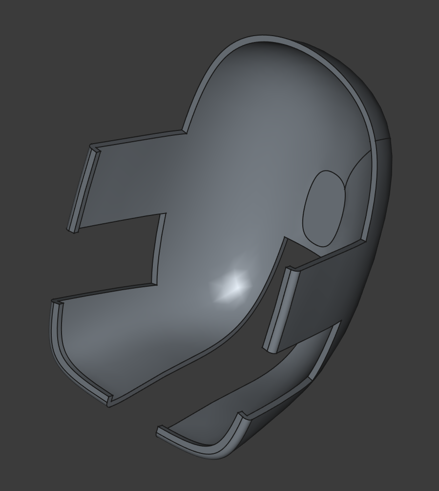
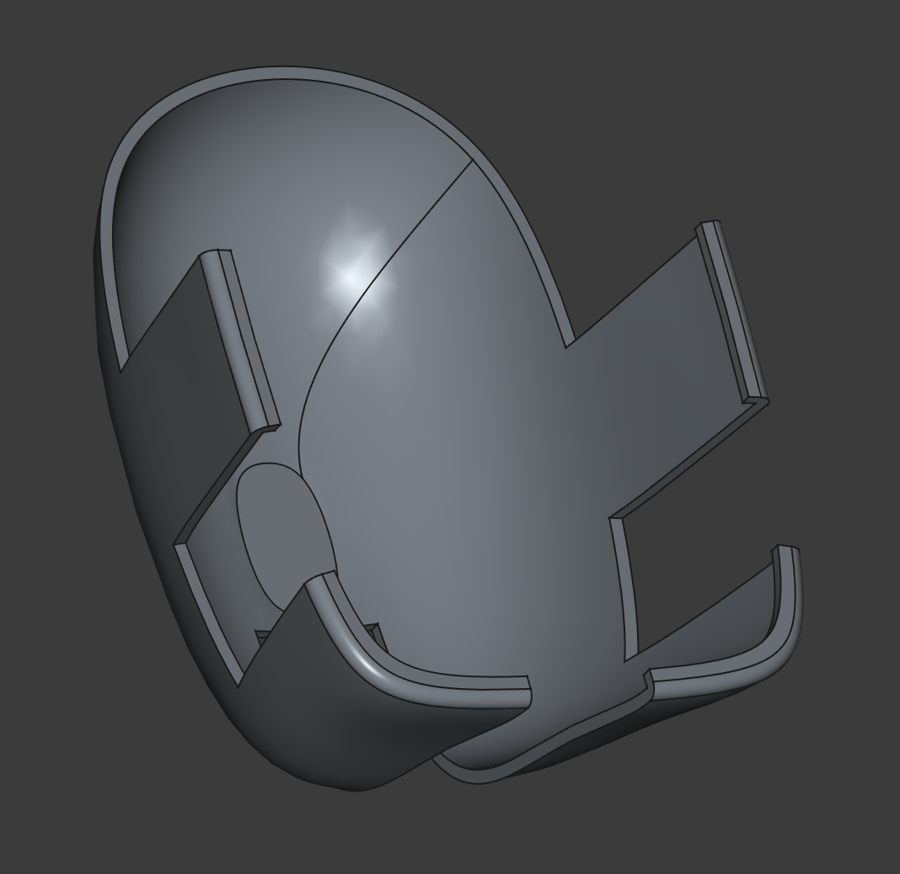
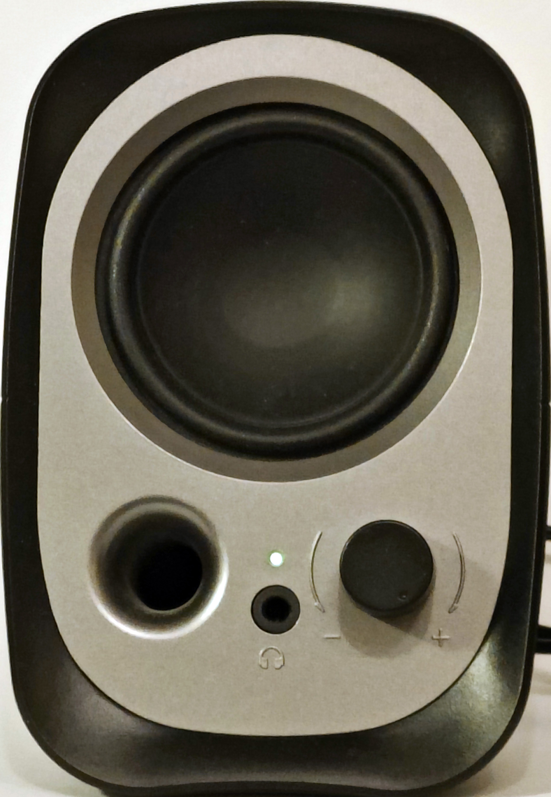
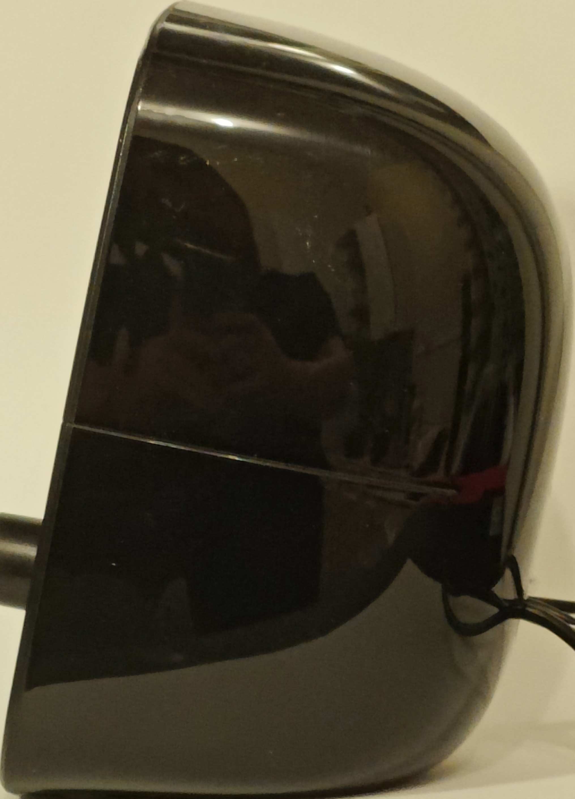

# Держатель колонок Edifier R12U

[&larr; Назад в список моделей](../README.md)

У меня есть компьютер на кухне. И чтобы он не занимал много места на кухонном столе, было придумано закрепить его на кронштейне так, что он не касается стола, и при необходимости его легко можно отвернуть и отвести в сторону так, чтобы кухонный стол оставался полностью функциональным. В идеальном варианте клавиатура и мышь должны были быть беспроводными, а колонки были подвешены на самом мониторе. Монитор без встроенных динамиков, поэтому пришлось колхозить. Использовались компактные плоские колонки Microlab B-55. Из фанеры выпилил нужную форму, просверлил отверстия и прикрепил за VESA-крепление. Монитор поддерживает сразу 2 VESA стандарта, так что к кронштейну он крепится на маленьком, а фанера держится на большом. И до какой-то поры это работало. Но данные колонки оказались недостаточно громкими, а некоторые фильмы и сериалы, которые там смотрели, были записаны с чрезвычайно низким уровнем записи так, что даже на максимальной громкости слышно не очень хорошо.

Поэтому постепенно тихие микролабовские колонки заменились на более громкие Edifier R12U. Это просто замечательные для своего размера и цены колонки. Но форма у них не плоская, подвесить их абсолютно не за что. По форме они напоминают яйцо, которое ничем не прихватить, ничем не зацепить. Поэтому было решено сделать держатель для этих колонок, который бы обхватывал колонки сзади и позволял подвешивать их на ту же фанеру, что осталась на мониторе. Правда задача эта оказалась весьма нетривиальной. Форма колонок очень сложная и её невозможно описать какими-то простыми примитивами. Нужно двигаться методом проб и ошибок. А в FreeCAD'е ещё так часто бывает, что закрадётся в модель в ходе множественных правок какой-то баг, и его уже никак не вычистить, только удалять половину модели и строить заново. Поэтому решил попробовать сгенерировать модель через макрос на Python'е. Сам FreeCAD поддерживает макросы. По сути его `.FCMacro` файлы -- это обычные переименованные `.py` файлы.

Хотя, изначально была вообще безумная идея: сфоткать колонку с разных углов, загрузить это всё в ChatGPT, и пусть он напишет код, который воспроизведёт модель этой самой колонки. Ну а уже из модели колонки не так сложно будет сделать модель держателя для неё же.

Однако, меня ждал очень жёсткий облом. Сначала всё было многообещающе. ChatGPT вёл себя очень уверенно, легко согласился на эту авантюру, попросил фотки, сказал, что ему всё понятно и он готов. А по итогу он раз за разом генерировал нерабочий код, который выдавал ошибку на каком-нибудь этапе. А когда после N'ного кол-ва итераций он всё же выдал рабочий код, то создалась простая модель усечённого эллипсоида. Он ещё перед этим меня спросил возможно ли немного упростить модель, например, не делать крутилку громкости, мембрану динамика, отверстие фазоинвертора... Но чтоб настолько упрощать... Тогда я решил попробовать ещё раз, но уже с "думающей" версией, которая в тот момент только-только появилась. Кажется, o1 или o1-preview. Эта версия вообще... Думала очень долго, тоже генерировала код с ошибками, а когда ошибок не было были какие-то странные формы с неправильной геометрией -- типа незамкнутой поверхности. В конце-концов, после нескольких часов исправлений у него получилась модель простой шайбы (цилиндра). И потом он начал мне объяснять почему получилась шайба и почему так и должно было быть.

Думаете я на этом сдался? Нифига! Я решил попробовать Grok AI. Там как раз недавно вышла версия Grok 3 (вроде бы ещё не думающая). Решил попробовать с ней. Результат был значительно лучше. Тоже куча ошибок. На один рабочий код примерно 5-10 вариантов с ошибками. Но объективно результат был, и он был лучше, чем с ChatGPT. Уж не знаю почему. Может конкретно с макросами FreeCAD у Grok было лучше обучение.

В итоге, после несколько недель правок и доработок совместно с Grok, получился более-менее рабочий вариант уже держателя, который полностью генерируется кодом макроса. Правда, после распечатки оказалось, что форма была угадана не полностью. Далее предстоит дорабатывать ещё эту форму.

## Файлы модели

* [SpeakerModel.stl](SpeakerModel.stl)
* [Speaker_by_Grok_2.FCMacro](Speaker_by_Grok_2.FCMacro)

## Картинки

