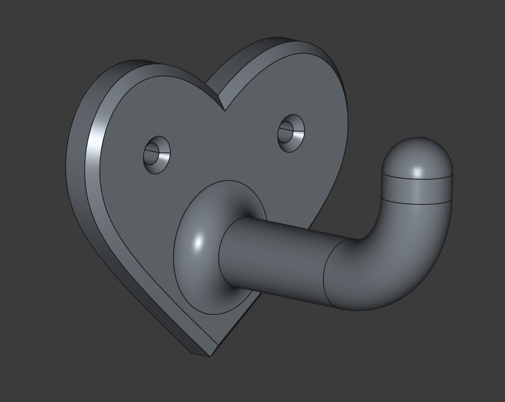
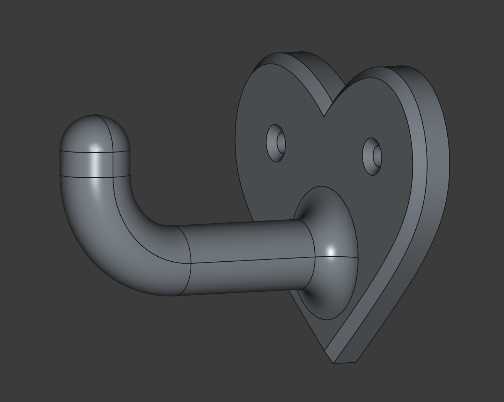
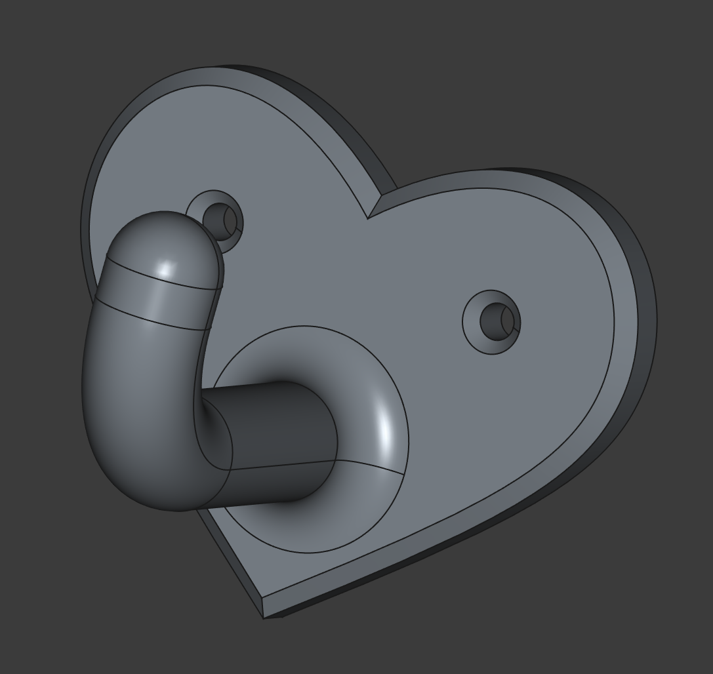
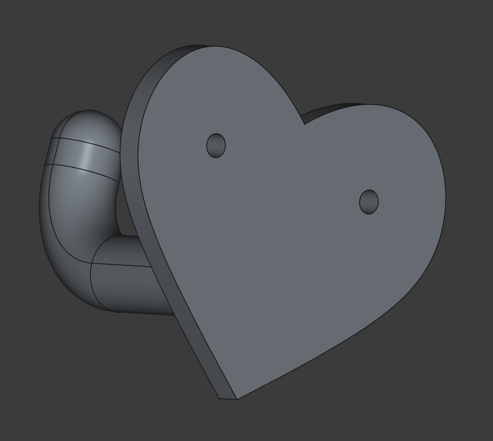
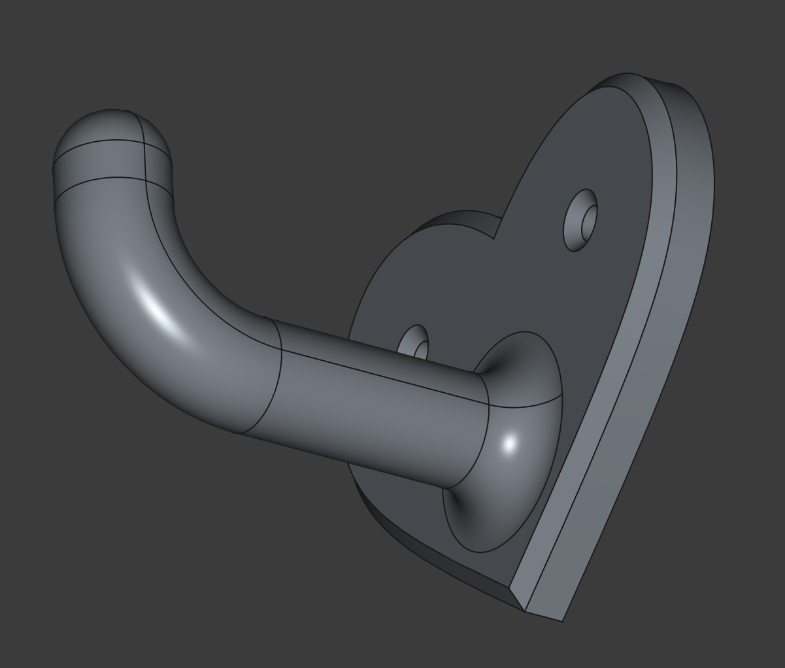

# Крючок для корзины с грязным бельем

[&larr; Назад в список моделей](../README.md)

Была у нас дома тряпичная корзина для грязного белья. Точнее для сортировки мусора, но мы использовали её для грязного белья. Она была с ручками, но вешать её было не на что. Она стояла в углу в коридоре между ванной и кухней, и вокруг неё и за ней постоянно скапливалась пыль. А чтобы пропылесосить или помыть пол приходилось каждый раз её поднимать. Это было неудобно и раздражало. Я решил подвесить её на самодельный крючок. Самодельный потому что найти в свободной продаже универсальный крючок довольно сложно. И я хотел, чтобы две ручки в форме колец идеально ровно помещались внутрь крючка без люфта. Сделал 2 точки крепления, чтобы крючок не мог вращаться, а достаточно низкое размещение носика крючка снижают эффект рычага и усилие на вырывание крепления. Печатал с достаточно толстыми стенками и большим процентом заполнения, чтобы обеспечить высокую прочность. Также добавил немного романтики, сделав крючок в форме сердечка. 

## Файлы модели

* [Крючок для корзины с грязным бельем.FCStd](%D0%9A%D1%80%D1%8E%D1%87%D0%BE%D0%BA%20%D0%B4%D0%BB%D1%8F%20%D0%BA%D0%BE%D1%80%D0%B7%D0%B8%D0%BD%D1%8B%20%D1%81%20%D0%B3%D1%80%D1%8F%D0%B7%D0%BD%D1%8B%D0%BC%20%D0%B1%D0%B5%D0%BB%D1%8C%D0%B5%D0%BC.FCStd)
* [Крючок для корзины с грязным бельем.stl](%D0%9A%D1%80%D1%8E%D1%87%D0%BE%D0%BA%20%D0%B4%D0%BB%D1%8F%20%D0%BA%D0%BE%D1%80%D0%B7%D0%B8%D0%BD%D1%8B%20%D1%81%20%D0%B3%D1%80%D1%8F%D0%B7%D0%BD%D1%8B%D0%BC%20%D0%B1%D0%B5%D0%BB%D1%8C%D0%B5%D0%BC.stl)

## Картинки

