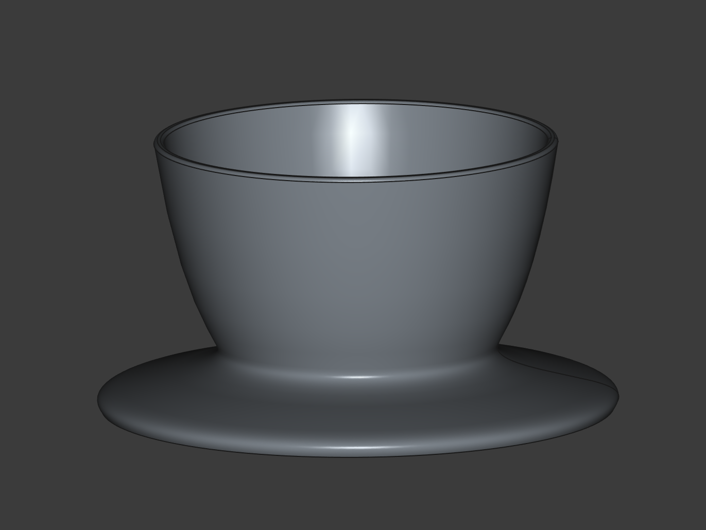
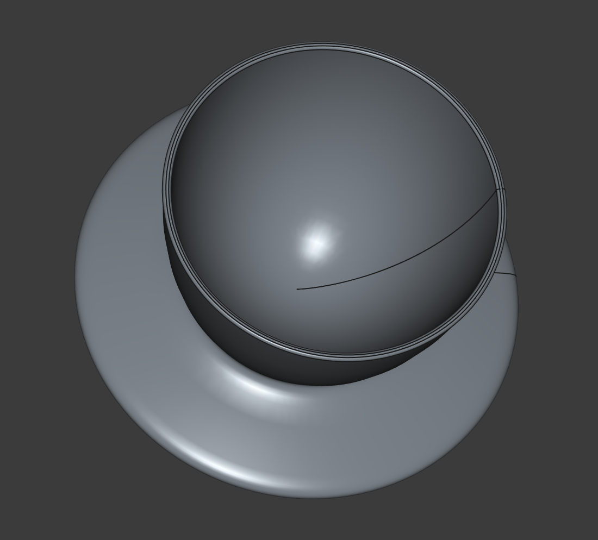
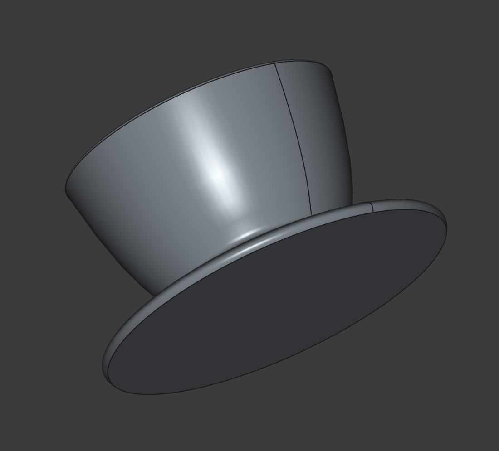
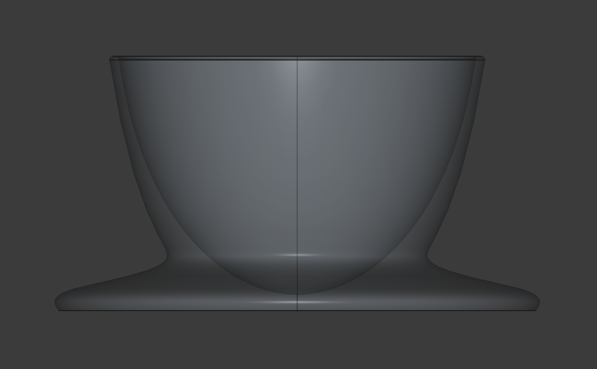
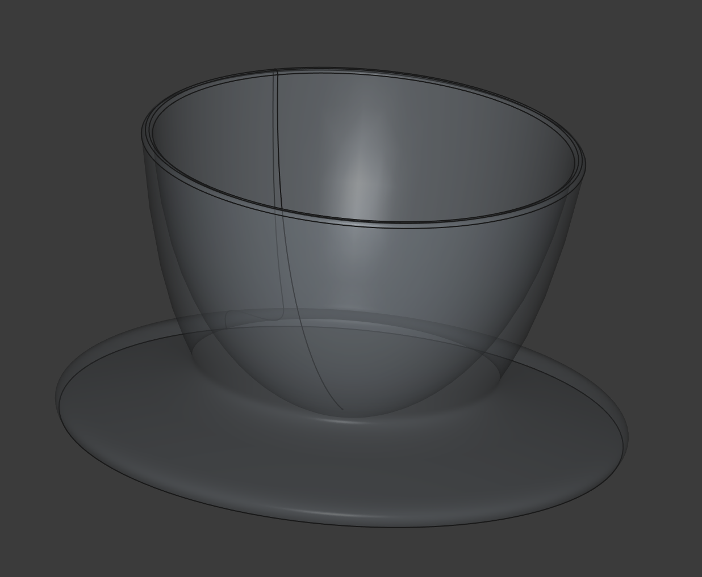

# Подставка под яйцо

В одном старом фильме про убийство в Восточном Экспрессе с Эркюлем Пуаро я видел сцену, где известный сыщик завтракает варёными яйцами, установленными на специальных металлических подставках. Мне это так понравилось, что я даже купил пару таки подставок. Я воспользовался ими пару раз, а потом они несколько лет лежали без дела в кухонном ящике. И в какой-то момент в порыве освобождения от всего ненужного я их выкинул. А потом мой младший сын впервые пробовал есть вареные яйца (я люблю когда они сварены так, что белок твердый, а желток жидкий), и ему было сложно управляться с этим, имея всего лишь 2 руки. Тогда я пожалел, что выкинул те подставки. Но решил тогда самостоятельно сделать аналогичную подставку. Не сказать, что она пользуется в семье большим спросом, но в моменте она смогла решить проблему.

## Файлы модели

* [Egg-Stand 3.stl](Egg-Stand%203.stl)
* [Подставка под яйцо 3.FCStd](%D0%9F%D0%BE%D0%B4%D1%81%D1%82%D0%B0%D0%B2%D0%BA%D0%B0%20%D0%BF%D0%BE%D0%B4%20%D1%8F%D0%B9%D1%86%D0%BE%203.FCStd)

## Картинки

