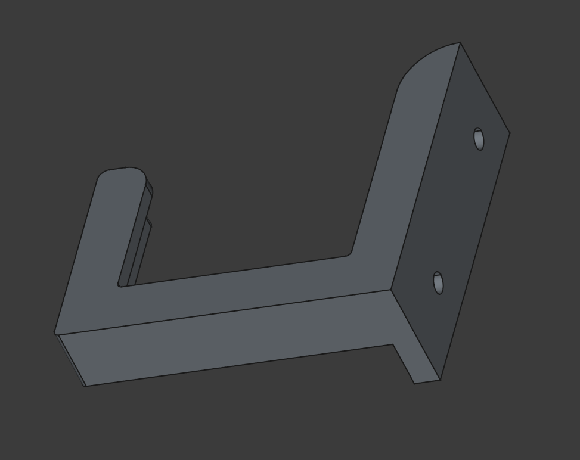

# Настенный держатель для Мини ПК в корпусе Foxline FL-103

Данный мини-ПК используется в качестве домашнего веб-сервера. И чтобы он не занимал место на горизонтальных поверхностях, было решено подвесить его на стенку с задней стороны стола. Для этого был спроектирован данный держатель. Точнее их 2 зеркальных и они обхватывают корпус по бокам снизу. Модель для правого держателя. Левый делается зеркалированием прямо в слайсере.

Каждый кронштейн крепится к ЛДСП на 2 самореза 4.0 x 20 мм с потайной головкой.

